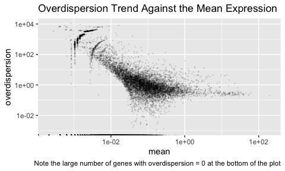

<!-- README.md is generated from README.Rmd. Please edit that file -->

# glmGamPoi

<!-- badges: start -->

[](https://github.com/const-ae/glmGamPoi)
[](https://codecov.io/gh/const-ae/glmGamPoi)
<!-- badges: end -->

> Fit Gamma-Poisson Generalized Linear Models Reliably.

The core design aims of `gmlGamPoi` are:

  - Fit the Gamma-Poisson models on arbitrarily large or small datasets
  - Be faster than alternative methods, such as `DESeq2` or `edgeR`
  - Calculate exact or approximate results based on user preference
  - Support in memory or on-disk data
  - Follow established conventions around tools for RNA-seq analysis
  - Present a simple user-interface
  - Avoid unnecessary dependencies
  - Make integration into other tools easy

## Installation

You can install the development version of `glmGamPoi` from
[Github](https://github.com/const-ae/glmGamPoi):

``` r
# install.packages("devtools")
devtools::install_github("const-ae/glmGamPoi")
```

Please make sure that you are using at least R `3.6` and BioConductor
`3.10`.

## Example

To fit a single Gamma-Poisson GLM do:

``` r
# overdispersion = 1/size
counts <- rnbinom(n = 10, mu = 5, size = 1/0.7)
# size_factors = FALSE, because only a single GLM is fitted
fit <- glmGamPoi::glm_gp(counts, design = ~ 1, size_factors = FALSE)
fit
#> glmGamPoiFit object:
#> The data had 1 rows and 10 columns.
#> A model with 1 coefficient was fitted.

# Internally fit is just a list:
c(fit)
#> $Beta
#>      Intercept
#> [1,] 0.9555114
#> 
#> $overdispersions
#> [1] 0
#> 
#> $Mu
#>      [,1] [,2] [,3] [,4] [,5] [,6] [,7] [,8] [,9] [,10]
#> [1,]  2.6  2.6  2.6  2.6  2.6  2.6  2.6  2.6  2.6   2.6
#> 
#> $size_factors
#>  [1] 1 1 1 1 1 1 1 1 1 1
#> 
#> $model_matrix
#>       Intercept
#>  [1,]         1
#>  [2,]         1
#>  [3,]         1
#>  [4,]         1
#>  [5,]         1
#>  [6,]         1
#>  [7,]         1
#>  [8,]         1
#>  [9,]         1
#> [10,]         1
#> attr(,"assign")
#> [1] 0
#> 
#> $design_formula
#> ~1
```

The `glm_gp()` function returns a list with the results of the fit. Most
importantly, it contains the estimates for the coefficients β and the
overdispersion.

Fitting repeated Gamma-Poisson GLMs for each gene of a single cell
dataset is just as easy:

I will first load an example dataset using the `TENxPBMCData` package.
The dataset has 33,000 genes and 4340 cells

``` r
pbmcs <- TENxPBMCData::TENxPBMCData("pbmc4k")
#> snapshotDate(): 2019-10-22
#> see ?TENxPBMCData and browseVignettes('TENxPBMCData') for documentation
#> loading from cache
pbmcs
#> class: SingleCellExperiment 
#> dim: 33694 4340 
#> metadata(0):
#> assays(1): counts
#> rownames(33694): ENSG00000243485 ENSG00000237613 ... ENSG00000277475
#>   ENSG00000268674
#> rowData names(3): ENSEMBL_ID Symbol_TENx Symbol
#> colnames: NULL
#> colData names(11): Sample Barcode ... Individual Date_published
#> reducedDimNames(0):
#> spikeNames(0):
#> altExpNames(0):
```

I call `glm_gp()` to fit one GLM model for each gene and force the
calculation to happen in memory.

``` r
# This takes ~1 minute
fit <- glmGamPoi::glm_gp(pbmcs, on_disk = FALSE)
```

Let’s look at the result:

``` r
# Overview of the fit:
# Best_est = -Inf means that `all(counts[i, ] == 0)` for gene i
summary(fit)
#> glmGamPoiFit object:
#> The data had 33694 rows and 4340 columns.
#> A model with 1 coefficient was fitted.
#> The design formula is: Y~1
#> 
#> Beta:
#>            Min 1st Qu. Median 3rd Qu.  Max
#> Intercept -Inf    -Inf  -7.68   -3.62 5.37
#> 
#> overdispersion:
#>  Min 1st Qu. Median 3rd Qu.   Max
#>    0       0      0   0.518 26741
#> 
#> size_factors:
#>    Min 1st Qu. Median 3rd Qu.  Max
#>  0.743   0.968      1    1.03 2.06
#> 
#> Mu:
#>  Min 1st Qu.   Median 3rd Qu. Max
#>    0       0 0.000488  0.0269 442


# Make a plot of mean-overdispersion relation
library(ggplot2)
ggplot(data.frame(mean=fit$Mu[,1], overdispersion=fit$overdispersions),
       aes(x=mean, y = overdispersion)) +
  geom_point(size = 0.1, alpha = 0.1) +
  scale_x_log10() + scale_y_log10() +
  labs(title = "Overdispersion Trend Against the Mean Expression",
       caption = "Note the large number of genes with overdispersion = 0 at the bottom of the plot")
```

<!-- -->

## Benchmark

For demonstration purposes, I create a sample benchmark with 300
non-empty genes from the `pbmc4k`
dataset:

``` r
non_empty_rows <- which(DelayedMatrixStats::rowSums2(SummarizedExperiment::assay(pbmcs)) > 0)
pbmcs_subset <- as.matrix(SummarizedExperiment::assay(pbmcs)[sample(non_empty_rows, 300), ])
model_matrix <- matrix(1, nrow = ncol(pbmcs_subset))
dim(pbmcs_subset)
#> [1]  300 4340
```

I compare my method (in-memory and on-disk) with `DESeq2` and `edgeR`.
Both are classical methods for analyzing RNA-Seq datasets and have been
around for almost 10 years. Note that both tools can do a lot more than
just fitting the Gamma-Poisson model, so this benchmark only serves to
give a general impression of the performance.

``` r
bench::mark(
  glmGamPoi_in_memory = {
    glmGamPoi::glm_gp(pbmcs_subset, design = model_matrix, on_disk = FALSE)
  }, glmGamPoi_on_disk = {
    glmGamPoi::glm_gp(pbmcs_subset, design = model_matrix, on_disk = TRUE)
  }, DESeq2 = suppressMessages({
    dds <- DESeq2::DESeqDataSetFromMatrix(pbmcs_subset,
                        colData = data.frame(name = seq_len(4340)),
                        design = ~ 1)
    dds <- DESeq2::estimateSizeFactors(dds, "poscounts")
    dds <- DESeq2::estimateDispersions(dds, quiet = TRUE)
    dds <- DESeq2::nbinomWaldTest(dds, minmu = 1e-6)
  }), edgeR = {
    edgeR_data <- edgeR::DGEList(pbmcs_subset)
    edgeR_data <- edgeR::calcNormFactors(edgeR_data)
    edgeR_data <- edgeR::estimateDisp(edgeR_data, model_matrix)
    edgeR_fit <- edgeR::glmFit(edgeR_data, design = model_matrix)
  }, check = FALSE
)
#> # A tibble: 4 x 6
#>   expression               min   median `itr/sec` mem_alloc `gc/sec`
#>   <bch:expr>          <bch:tm> <bch:tm>     <dbl> <bch:byt>    <dbl>
#> 1 glmGamPoi_in_memory 759.36ms 759.36ms    1.32    328.44MB   1.32  
#> 2 glmGamPoi_on_disk      3.39s    3.39s    0.295   681.08MB   0     
#> 3 DESeq2                24.84s   24.84s    0.0403    1.15GB   0.0805
#> 4 edgeR                  4.91s    4.91s    0.204   978.57MB   0.204
```

On this dataset, `glmGamPoi` is more than 6 times faster than `edgeR`
and more than 30 times faster than `DESeq2`. `glmGamPoi` does **not**
use approximations to achieve this performance increase. The performance
comes from an optimized algorithm for inferring the overdispersion for
each gene. It is tuned for datasets typically encountered in single
RNA-seq with many samples and many small counts, by avoiding duplicate
calculations.

To demonstrate that the method is not sacrificing accuracy, I compare
the parameters that each method estimates. I find that means and β
coefficients are identical, but that the estimates of the overdispersion
estimates from `glmGamPoi` are more reliable:

``` r
# Results with my method
fit <- glmGamPoi::glm_gp(pbmcs_subset, design = model_matrix, on_disk = FALSE)

# DESeq2
dds <- DESeq2::DESeqDataSetFromMatrix(pbmcs_subset, 
                        colData = data.frame(name = seq_len(4340)),
                        design = ~ 1)
dds <- DESeq2::estimateSizeFactors(dds, "poscounts")
dds <- DESeq2::estimateDispersions(dds, quiet = TRUE)
dds <- DESeq2::nbinomWaldTest(dds, minmu = 1e-6)

#edgeR
edgeR_data <- edgeR::DGEList(pbmcs_subset)
edgeR_data <- edgeR::calcNormFactors(edgeR_data)
edgeR_data <- edgeR::estimateDisp(edgeR_data, model_matrix)
edgeR_fit <- edgeR::glmFit(edgeR_data, design = model_matrix)
```

<!-- -->

I am comparing the gene-wise estimates of the coefficients from all
three methods. Points on the diagonal line are identical. The inferred
Beta coefficients and gene means agree well between the methods, however
the overdispersion differs quite a bit. `DESeq2` has problems estimating
most of the overdispersions and sets them to `1e-8`. `edgeR` only
approximates the overdispersions which explains the variation around the
overdispersions calculated with `glmGamPoi`.

## Scalability

The method scales linearly, with the number of rows and columns in the
dataset. For example: fitting the full `pbmc4k` dataset on a modern
MacBook Pro in-memory takes ~1 minute and on-disk a little over 4
minutes. Fitting the `pbmc68k` (17x the size) takes ~73 minutes (17x the
time) on-disk. Fitting that dataset in-memory is not possible because it
is just too big: the maximum in-memory matrix size is `2^31-1 ≈ 2.1e9`
is elements, the `pbmc68k` dataset however has nearly 100 million
elements more than that.
