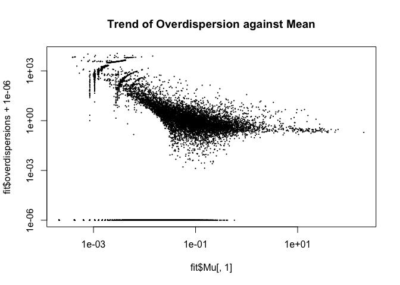

<!-- README.md is generated from README.Rmd. Please edit that file -->

# glmGamPoi

<!-- badges: start -->

<!-- badges: end -->

> Fit Small and Large Scale Gamma-Poisson Generalized Linear Models.

*Gamma-Poisson is just another name for the Negative Binomial model. It
however better emphasizes the overdispersed count nature of this model.*

`glmGamPoi` provides an easy to use interface to fit Gamma-Poisson
models efficiently. It is designed to handle large scale datasets with
thousands of rows and columns as they are typically encountered in
modern high-throughput biology. It can automatically determine the
appropriate size factors to normalize for different sizes across samples
and infer the overdispersion for each row in the input matrix. The
package can handle in-memory datasets, but also on-disk matrices with
the `DelayedArray` package.

## Installation

You can install the development version of `glmGamPoi` from
[Github](https://github.com/const-ae/glmGamPoi):

``` r
# install.packages("devtools")
devtools::install_github("const-ae/glmGamPoi")
```

Please make sure that you are using at least version `3.6` of R and
`3.10` of BioConductor.

## Example

To fit a single Gamma-Poisson GLM do:

``` r
# overdispersion = 1/size
counts <- rnbinom(n = 10, mu = 5, size = 1/0.7)
# size_factors = FALSE, because only a single GLM is fitted
glmGamPoi::glm_gp(counts, design = ~ 1, size_factors = FALSE)
#> $Beta_est
#>          [,1]
#> [1,] 1.547563
#> 
#> $overdispersions
#> [1] 1.695537
#> 
#> $Mu_est
#>      [,1] [,2] [,3] [,4] [,5] [,6] [,7] [,8] [,9] [,10]
#> [1,]  4.7  4.7  4.7  4.7  4.7  4.7  4.7  4.7  4.7   4.7
#> 
#> $size_factors
#>  [1] 1 1 1 1 1 1 1 1 1 1
#> 
#> $model_matrix
#>       Intercept
#>  [1,]         1
#>  [2,]         1
#>  [3,]         1
#>  [4,]         1
#>  [5,]         1
#>  [6,]         1
#>  [7,]         1
#>  [8,]         1
#>  [9,]         1
#> [10,]         1
#> attr(,"assign")
#> [1] 0
#> 
#> $design_formula
#> ~1
```

The `glm_gp()` function returns a list with the results of the fit. Most
importantly, it contains the estimates for the coefficients β and the
overdispersion.

Fitting repeated Gamma-Poisson GLMs for each gene of a single cell
dataset is just as easy:

``` r
pbmcs <- TENxPBMCData::TENxPBMCData("pbmc4k")
#> snapshotDate(): 2019-04-29
#> see ?TENxPBMCData and browseVignettes('TENxPBMCData') for documentation
#> downloading 0 resources
#> loading from cache 
#>     'EH1613 : 1613'
pbmcs
#> class: SingleCellExperiment 
#> dim: 33694 4340 
#> metadata(0):
#> assays(1): counts
#> rownames(33694): ENSG00000243485 ENSG00000237613 ...
#>   ENSG00000277475 ENSG00000268674
#> rowData names(3): ENSEMBL_ID Symbol_TENx Symbol
#> colnames: NULL
#> colData names(11): Sample Barcode ... Individual Date_published
#> reducedDimNames(0):
#> spikeNames(0):
# Fit the Gamma-Poisson Model. Force calculation to be in memory
fit <- glmGamPoi::glm_gp(pbmcs, on_disk = FALSE)
# First fitted values. -Inf indicates rows that contained only zeros.
head(fit$Beta_est)
#>           [,1]
#> [1,]      -Inf
#> [2,]      -Inf
#> [3,]      -Inf
#> [4,] -6.180259
#> [5,] -7.684337
#> [6,]      -Inf

plot(fit$Mu[,1], fit$overdispersions + 1e-6, 
     log ="xy", pch = 16, cex = 0.3,
     main = "Trend of Overdispersion against Mean")
#> Warning in xy.coords(x, y, xlabel, ylabel, log): 13921 x values <= 0
#> omitted from logarithmic plot
```



## Benchmark

For demonstration purposes, I create a sample benchmark with 300
non-empty genes from the `pbmc4k` dataset:

``` r
non_empty_rows <- which(DelayedMatrixStats::rowSums2(assay(pbmcs)) > 0)
pbmcs_subset <- as.matrix(SummarizedExperiment::assay(pbmcs)[sample(non_empty_rows, 300), ])
model_matrix <- matrix(1, nrow = ncol(pbmcs_subset))
dim(pbmcs_subset)
#> [1]  300 4340
```

I compare my method running in-memory and on-disk with `DESeq2` and
`edgeR`. Both are classical methods for analyzing RNA-Seq datasets and
have been around for almost 10 years. (Note that both can do a lot more
than just fitting the Gamma-Poisson model, so this benchmark only serves
to give a general impression of the performance.)

``` r
bench::mark(
  glmGamPoi_in_memory = {
    glmGamPoi::glm_gp(pbmcs_subset, design = model_matrix, on_disk = FALSE)
  }, glmGamPoi_on_disk = {
    glmGamPoi::glm_gp(pbmcs_subset, design = model_matrix, on_disk = TRUE)
  }, DESeq2 = suppressMessages({
    dds <- DESeq2::DESeqDataSetFromMatrix(pbmcs_subset, 
                        colData = data.frame(name = seq_len(4340)),
                        design = ~ 1)
    dds <- DESeq2::estimateSizeFactors(dds, "poscounts")
    dds <- DESeq2::estimateDispersions(dds, quiet = TRUE)
    dds <- DESeq2::nbinomWaldTest(dds, minmu = 1e-6)
  }), edgeR = {
    edgeR_data <- edgeR::DGEList(pbmcs_subset)
    edgeR_data <- edgeR::calcNormFactors(edgeR_data)
    edgeR_data <- edgeR::estimateDisp(edgeR_data, model_matrix)
    fit <- edgeR::glmFit(edgeR_data, design = model_matrix)
  }, check = FALSE
)
#> Warning: Some expressions had a GC in every iteration; so filtering is
#> disabled.
#> # A tibble: 4 x 6
#>   expression               min   median `itr/sec` mem_alloc `gc/sec`
#>   <bch:expr>          <bch:tm> <bch:tm>     <dbl> <bch:byt>    <dbl>
#> 1 glmGamPoi_in_memory 402.09ms 402.77ms    2.48    249.61MB   0     
#> 2 glmGamPoi_on_disk      3.45s    3.45s    0.290   755.39MB   0.290 
#> 3 DESeq2                15.29s   15.29s    0.0654    1.14GB   0.0654
#> 4 edgeR                  5.17s    5.17s    0.194   971.51MB   0.387
```

Fitting the full `pbmc4k` dataset on a modern MacBook Pro in-memory
takes ~1 minute and on-disk ~4 minutes. Fitting the `pbmc68k` (17x the
size) takes ~73 minutes (17x the time) on-disk. Fitting that dataset
in-memory is not possible because it is just too big: the maximum
in-memory matrix size is `2^31-1 ≈ 2.1e9` is elements, the `pbmc68k`
dataset however has nearly 100 million more elements.
