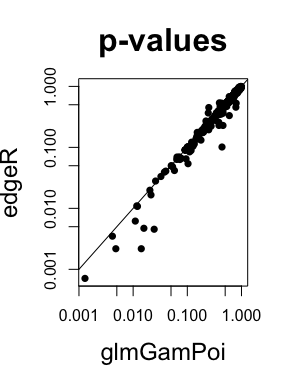

<!-- README.md is generated from README.Rmd. Please edit that file -->

# glmGamPoi <a href='https://github.com/const-ae/glmGamPoi'></a>

<!-- badges: start -->

[](https://codecov.io/gh/const-ae/glmGamPoi)
<!-- badges: end -->

> Fit Gamma-Poisson Generalized Linear Models Reliably.

Pronounciation: [`dʒi əl əm ɡam
ˈpwɑ`](http://ipa-reader.xyz/?text=d%CA%92i%20%C9%99l%20%C9%99m%20%C9%A1am%20%CB%88pw%C9%91)

The core design aims of `glmGamPoi` are:

  - Fit Gamma-Poisson models on arbitrarily large or small datasets
  - Be faster than alternative methods, such as `DESeq2` or `edgeR`
  - Calculate exact or approximate results based on user preference
  - Support in-memory or on-disk data
  - Follow established conventions around tools for RNA-seq analysis
  - Present a simple user-interface
  - Avoid unnecessary dependencies
  - Make integration into other tools easy

# Installation

You can install the release version of
*[glmGamPoi](https://bioconductor.org/packages/glmGamPoi)* from
BioConductor:

``` r
if (!requireNamespace("BiocManager", quietly = TRUE))
    install.packages("BiocManager")

BiocManager::install("glmGamPoi")
```

For the latest developments, see the
*[GitHub](https://github.com/const-ae/glmGamPoi)* repo.

# Example

Load the glmGamPoi package

``` r
library(glmGamPoi)
```

To fit a single Gamma-Poisson GLM do:

``` r
# overdispersion = 1/size
counts <- rnbinom(n = 10, mu = 5, size = 1/0.7)

# design = ~ 1 means that an intercept-only model is fit
fit <- glm_gp(counts, design = ~ 1)
fit
#> glmGamPoiFit object:
#> The data had 1 rows and 10 columns.
#> A model with 1 coefficient was fitted.

# Internally fit is just a list:
as.list(fit)[1:2]
#> $Beta
#>      Intercept
#> [1,]  1.504077
#> 
#> $overdispersions
#> [1] 0.3792855
```

The `glm_gp()` function returns a list with the results of the fit. Most
importantly, it contains the estimates for the coefficients β and the
overdispersion.

Fitting repeated Gamma-Poisson GLMs for each gene of a single cell
dataset is just as easy:

I will first load an example dataset using the `TENxPBMCData` package.
The dataset has 33,000 genes and 4340 cells. It takes roughly 1.5
minutes to fit the Gamma-Poisson model on the full dataset. For
demonstration purposes, I will subset the dataset to 300 genes, but keep
the 4340 cells:

``` r
library(SummarizedExperiment)
library(DelayedMatrixStats)
```

``` r
# The full dataset with 33,000 genes and 4340 cells
# The first time this is run, it will download the data
pbmcs <- TENxPBMCData::TENxPBMCData("pbmc4k")
#> snapshotDate(): 2020-04-27
#> see ?TENxPBMCData and browseVignettes('TENxPBMCData') for documentation
#> loading from cache

# I want genes where at least some counts are non-zero
non_empty_rows <- which(rowSums2(assay(pbmcs)) > 0)
pbmcs_subset <- pbmcs[sample(non_empty_rows, 300), ]
pbmcs_subset
#> class: SingleCellExperiment 
#> dim: 300 4340 
#> metadata(0):
#> assays(1): counts
#> rownames(300): ENSG00000126457 ENSG00000109832 ... ENSG00000143819
#>   ENSG00000188243
#> rowData names(3): ENSEMBL_ID Symbol_TENx Symbol
#> colnames: NULL
#> colData names(11): Sample Barcode ... Individual Date_published
#> reducedDimNames(0):
#> altExpNames(0):
```

I call `glm_gp()` to fit one GLM model for each gene and force the
calculation to happen in memory.

``` r
fit <- glm_gp(pbmcs_subset, on_disk = FALSE)
summary(fit)
#> glmGamPoiFit object:
#> The data had 300 rows and 4340 columns.
#> A model with 1 coefficient was fitted.
#> The design formula is: Y~1
#> 
#> Beta:
#>             Min 1st Qu. Median 3rd Qu.   Max
#> Intercept -8.51   -6.57  -3.91   -2.59 0.903
#> 
#> deviance:
#>  Min 1st Qu. Median 3rd Qu.  Max
#>   14    86.8    657    1686 5507
#> 
#> overdispersion:
#>  Min  1st Qu. Median 3rd Qu.   Max
#>    0 1.65e-13  0.288    1.84 24687
#> 
#> Shrunken quasi-likelihood overdispersion:
#>    Min 1st Qu. Median 3rd Qu.  Max
#>  0.707   0.991      1    1.04 7.45
#> 
#> size_factors:
#>    Min 1st Qu. Median 3rd Qu.  Max
#>  0.117   0.738   1.01    1.32 14.5
#> 
#> Mu:
#>       Min 1st Qu. Median 3rd Qu.  Max
#>  2.34e-05 0.00142 0.0185  0.0779 35.8
```

# Benchmark

I compare my method (in-memory and on-disk) with
*[DESeq2](https://bioconductor.org/packages/3.11/DESeq2)* and
*[edgeR](https://bioconductor.org/packages/3.11/edgeR)*. Both are
classical methods for analyzing RNA-Seq datasets and have been around
for almost 10 years. Note that both tools can do a lot more than just
fitting the Gamma-Poisson model, so this benchmark only serves to give a
general impression of the performance.

``` r
# Explicitly realize count matrix in memory so that it is a fair comparison
pbmcs_subset <- as.matrix(assay(pbmcs_subset))
model_matrix <- matrix(1, nrow = ncol(pbmcs_subset))


bench::mark(
  glmGamPoi_in_memory = {
    glm_gp(pbmcs_subset, design = model_matrix, on_disk = FALSE)
  }, glmGamPoi_on_disk = {
    glm_gp(pbmcs_subset, design = model_matrix, on_disk = TRUE)
  }, DESeq2 = suppressMessages({
    dds <- DESeq2::DESeqDataSetFromMatrix(pbmcs_subset,
                        colData = data.frame(name = seq_len(4340)),
                        design = ~ 1)
    dds <- DESeq2::estimateSizeFactors(dds, "poscounts")
    dds <- DESeq2::estimateDispersions(dds, quiet = TRUE)
    dds <- DESeq2::nbinomWaldTest(dds, minmu = 1e-6)
  }), edgeR = {
    edgeR_data <- edgeR::DGEList(pbmcs_subset)
    edgeR_data <- edgeR::calcNormFactors(edgeR_data)
    edgeR_data <- edgeR::estimateDisp(edgeR_data, model_matrix)
    edgeR_fit <- edgeR::glmFit(edgeR_data, design = model_matrix)
  }, check = FALSE, min_iterations = 3
)
#> # A tibble: 4 x 6
#>   expression               min   median `itr/sec` mem_alloc `gc/sec`
#>   <bch:expr>          <bch:tm> <bch:tm>     <dbl> <bch:byt>    <dbl>
#> 1 glmGamPoi_in_memory    1.06s    1.11s    0.874   508.84MB    3.20 
#> 2 glmGamPoi_on_disk      4.22s    4.29s    0.228   837.42MB    1.29 
#> 3 DESeq2                20.38s   20.45s    0.0486    1.16GB    0.389
#> 4 edgeR                  5.51s    5.52s    0.176     1.19GB    1.47
```

On this dataset, `glmGamPoi` is more than 5 times faster than `edgeR`
and more than 18 times faster than `DESeq2`. `glmGamPoi` does **not**
use approximations to achieve this performance increase. The performance
comes from an optimized algorithm for inferring the overdispersion for
each gene. It is tuned for datasets typically encountered in single
RNA-seq with many samples and many small counts, by avoiding duplicate
calculations.

To demonstrate that the method does not sacrifice accuracy, I compare
the parameters that each method estimates. The means and β coefficients
are identical, but that the overdispersion estimates from `glmGamPoi`
are more reliable:

``` r
# Results with my method
fit <- glm_gp(pbmcs_subset, design = model_matrix, on_disk = FALSE)

# DESeq2
dds <- DESeq2::DESeqDataSetFromMatrix(pbmcs_subset, 
                        colData = data.frame(name = seq_len(4340)),
                        design = ~ 1)
sizeFactors(dds)  <- fit$size_factors
dds <- DESeq2::estimateDispersions(dds, quiet = TRUE)
dds <- DESeq2::nbinomWaldTest(dds, minmu = 1e-6)

#edgeR
edgeR_data <- edgeR::DGEList(pbmcs_subset, lib.size = fit$size_factors)
edgeR_data <- edgeR::estimateDisp(edgeR_data, model_matrix)
edgeR_fit <- edgeR::glmFit(edgeR_data, design = model_matrix)
```

<!-- -->

I am comparing the gene-wise estimates of the coefficients from all
three methods. Points on the diagonal line are identical. The inferred
Beta coefficients and gene means agree well between the methods, however
the overdispersion differs quite a bit. `DESeq2` has problems estimating
most of the overdispersions and sets them to `1e-8`. `edgeR` only
approximates the overdispersions which explains the variation around the
overdispersions calculated with `glmGamPoi`.

## Scalability

The method scales linearly, with the number of rows and columns in the
dataset. For example: fitting the full `pbmc4k` dataset with subsampling
on a modern MacBook Pro in-memory takes \~1 minute and on-disk a little
over 4 minutes. Fitting the `pbmc68k` (17x the size) takes \~73 minutes
(17x the time) on-disk.

## Differential expression analysis

`glmGamPoi` provides an interface to do quasi-likelihood ratio testing
to identify differentially expressed genes:

``` r
# Create random categorical assignment to demonstrate DE
group <- sample(c("Group1", "Group2"), size = ncol(pbmcs_subset), replace = TRUE)

# Fit model with group vector as design
fit <- glm_gp(pbmcs_subset, design = group)
# Compare against model without group 
res <- test_de(fit, reduced_design = ~ 1)
# Look at first 6 genes
head(res)
#>              name      pval  adj_pval f_statistic df1      df2 lfc
#> 1 ENSG00000126457 0.2385897 0.8863222 1.389282669   1 4420.177  NA
#> 2 ENSG00000109832 0.6491580 0.9275674 0.206991636   1 4420.177  NA
#> 3 ENSG00000237339 0.4375426 0.9053288 0.602828102   1 4420.177  NA
#> 4 ENSG00000075234 0.3118470 0.8877737 1.023070956   1 4420.177  NA
#> 5 ENSG00000161057 0.9429562 0.9870835 0.005120673   1 4420.177  NA
#> 6 ENSG00000151366 0.5245736 0.9225491 0.404956210   1 4420.177  NA
```

The p-values agree well with the ones that `edgeR` is calculating. This
is because `glmGamPoi` uses the same framework of quasi-likelihood ratio
tests that was invented by `edgeR` and is described in [Lund et
al. (2012)](https://doi.org/10.1515/1544-6115.1826).

``` r
model_matrix <- model.matrix(~ group, data = data.frame(group = group))
edgeR_data <- edgeR::DGEList(pbmcs_subset)
edgeR_data <- edgeR::calcNormFactors(edgeR_data)
edgeR_data <- edgeR::estimateDisp(edgeR_data, design = model_matrix)
edgeR_fit <- edgeR::glmQLFit(edgeR_data, design = model_matrix)
edgeR_test <- edgeR::glmQLFTest(edgeR_fit, coef = 2)
edgeR_res <- edgeR::topTags(edgeR_test, sort.by = "none", n = nrow(pbmcs_subset))
```

<!-- -->

#### Pseudobulk

Be very careful how you interpret the p-values of a single cell
experiment. Cells that come from one individual are not independent
replicates. That means that you cannot turn your RNA-seq experiment with
3 treated and 3 control samples into a 3000 vs 3000 experiment by
measuring 1000 cells per sample. The actual unit of replication are
still the 3 samples in each condition.

Nonetheless, single cell data is valuable because it allows you to
compare the effect of a treatment on specific cell types. The simplest
way to do such a test is called pseudobulk. This means that the data is
subset to the cells of a specific cell type. Then the counts of cells
from the same sample are combined to form a “pseudobulk” sample. The
`test_de()` function of glmGamPoi supports this feature directly through
the `pseudobulk_by` and `subset_to` parameters:

``` r
# say we have cell type labels for each cell and know from which sample they come originally
sample_labels <- rep(paste0("sample_", 1:6), length = ncol(pbmcs_subset))
cell_type_labels <- sample(c("T-cells", "B-cells", "Macrophages"), ncol(pbmcs_subset), replace = TRUE)

test_de(fit, contrast = Group1 - Group2,
        pseudobulk_by = sample_labels, 
        subset_to = cell_type_labels == "T-cells",
        n_max = 4, sort_by = pval, decreasing = FALSE)
#>                name       pval adj_pval f_statistic df1     df2        lfc
#> 218 ENSG00000158411 0.04705062        1    5.419094   1 8.34284 -15.892119
#> 300 ENSG00000188243 0.04992313        1    5.246766   1 8.34284   4.053388
#> 110 ENSG00000134539 0.05867890        1    4.790498   1 8.34284  10.438251
#> 299 ENSG00000143819 0.07401184        1    4.169118   1 8.34284 -42.754649
```

# Session Info

``` r
sessionInfo()
#> R version 4.0.0 Patched (2020-05-04 r78358)
#> Platform: x86_64-apple-darwin17.0 (64-bit)
#> Running under: macOS Mojave 10.14.6
#> 
#> Matrix products: default
#> BLAS:   /Library/Frameworks/R.framework/Versions/4.0/Resources/lib/libRblas.dylib
#> LAPACK: /Library/Frameworks/R.framework/Versions/4.0/Resources/lib/libRlapack.dylib
#> 
#> locale:
#> [1] en_US.UTF-8/en_US.UTF-8/en_US.UTF-8/C/en_US.UTF-8/en_US.UTF-8
#> 
#> attached base packages:
#> [1] parallel  stats4    stats     graphics  grDevices utils     datasets 
#> [8] methods   base     
#> 
#> other attached packages:
#>  [1] TENxPBMCData_1.6.0          HDF5Array_1.16.1           
#>  [3] rhdf5_2.32.0                SingleCellExperiment_1.10.1
#>  [5] DelayedMatrixStats_1.10.1   SummarizedExperiment_1.18.1
#>  [7] DelayedArray_0.14.0         matrixStats_0.56.0         
#>  [9] Biobase_2.48.0              GenomicRanges_1.40.0       
#> [11] GenomeInfoDb_1.24.0         IRanges_2.22.1             
#> [13] S4Vectors_0.26.0            BiocGenerics_0.34.0        
#> [15] glmGamPoi_1.1.10           
#> 
#> loaded via a namespace (and not attached):
#>  [1] bitops_1.0-6                  bit64_0.9-7                  
#>  [3] RColorBrewer_1.1-2            httr_1.4.1                   
#>  [5] tools_4.0.0                   utf8_1.1.4                   
#>  [7] R6_2.4.1                      DBI_1.1.0                    
#>  [9] colorspace_1.4-1              tidyselect_1.1.0             
#> [11] DESeq2_1.29.4                 bit_1.1-15.2                 
#> [13] curl_4.3                      compiler_4.0.0               
#> [15] cli_2.0.2                     scales_1.1.0                 
#> [17] bench_1.1.1                   genefilter_1.70.0            
#> [19] rappdirs_0.3.1                stringr_1.4.0                
#> [21] digest_0.6.25                 rmarkdown_2.1                
#> [23] XVector_0.28.0                pkgconfig_2.0.3              
#> [25] htmltools_0.4.0               dbplyr_1.4.3                 
#> [27] fastmap_1.0.1                 limma_3.44.1                 
#> [29] rlang_0.4.6                   RSQLite_2.2.0                
#> [31] shiny_1.4.0.2                 generics_0.0.2               
#> [33] BiocParallel_1.22.0           dplyr_1.0.0                  
#> [35] RCurl_1.98-1.2                magrittr_1.5                 
#> [37] GenomeInfoDbData_1.2.3        Matrix_1.2-18                
#> [39] fansi_0.4.1                   Rcpp_1.0.4.6                 
#> [41] munsell_0.5.0                 Rhdf5lib_1.10.0              
#> [43] lifecycle_0.2.0               stringi_1.4.6                
#> [45] yaml_2.2.1                    edgeR_3.27.8                 
#> [47] zlibbioc_1.34.0               BiocFileCache_1.12.0         
#> [49] AnnotationHub_2.20.0          grid_4.0.0                   
#> [51] blob_1.2.1                    promises_1.1.0               
#> [53] ExperimentHub_1.14.0          crayon_1.3.4                 
#> [55] lattice_0.20-41               profmem_0.5.0                
#> [57] beachmat_2.4.0                splines_4.0.0                
#> [59] annotate_1.66.0               locfit_1.5-9.4               
#> [61] knitr_1.28                    pillar_1.4.4                 
#> [63] geneplotter_1.66.0            XML_3.99-0.3                 
#> [65] glue_1.4.0                    BiocVersion_3.11.1           
#> [67] evaluate_0.14                 BiocManager_1.30.10          
#> [69] vctrs_0.3.1                   httpuv_1.5.2                 
#> [71] gtable_0.3.0                  purrr_0.3.4                  
#> [73] assertthat_0.2.1              ggplot2_3.3.0                
#> [75] xfun_0.13                     mime_0.9                     
#> [77] xtable_1.8-4                  later_1.0.0                  
#> [79] survival_3.1-12               tibble_3.0.1                 
#> [81] AnnotationDbi_1.50.0          memoise_1.1.0                
#> [83] ellipsis_0.3.0                interactiveDisplayBase_1.26.3
#> [85] BiocStyle_2.16.0
```
