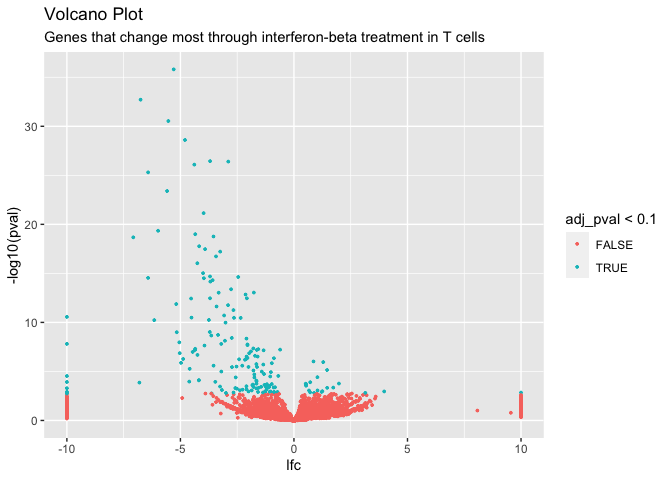
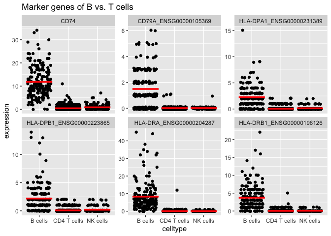

<!-- README.md is generated from README.Rmd. Please edit that file -->

# glmGamPoi <a href='https://github.com/const-ae/glmGamPoi'></a>

<!-- badges: start -->

[](https://codecov.io/gh/const-ae/glmGamPoi)
<!-- badges: end -->

> Fit Gamma-Poisson Generalized Linear Models Reliably.

Pronounciation:
[`dʒi əl əm ɡam ˈpwɑ`](http://ipa-reader.xyz/?text=d%CA%92i%20%C9%99l%20%C9%99m%20%C9%A1am%20%CB%88pw%C9%91)

The core design aims of `glmGamPoi` are:

- Fit Gamma-Poisson models on arbitrarily large or small datasets
- Be faster than alternative methods, such as `DESeq2` or `edgeR`
- Calculate exact or approximate results based on user preference
- Support in-memory or on-disk data
- Follow established conventions around tools for RNA-seq analysis
- Present a simple user-interface
- Avoid unnecessary dependencies
- Make integration into other tools easy

# Installation

You can install the release version of
*[glmGamPoi](https://bioconductor.org/packages/glmGamPoi)* from
BioConductor:

``` r
if (!requireNamespace("BiocManager", quietly = TRUE))
    install.packages("BiocManager")

BiocManager::install("glmGamPoi")
```

For the latest developments, see the
*[GitHub](https://github.com/const-ae/glmGamPoi)* repo.

If you use this package in a scientific publication, please cite:

> glmGamPoi: Fitting Gamma-Poisson Generalized Linear Models on Single
> Cell Count Data  
> Constantin Ahlmann-Eltze, Wolfgang Huber  
> Bioinformatics; 2020-12-09; doi:
> <https://doi.org/10.1093/bioinformatics/btaa1009>

# Example

Load the glmGamPoi package

``` r
library(glmGamPoi)
```

To fit a single Gamma-Poisson GLM do:

``` r
# overdispersion = 1/size
counts <- rnbinom(n = 10, mu = 5, size = 1/0.7)

# design = ~ 1 means that an intercept-only model is fit
fit <- glm_gp(counts, design = ~ 1)
fit
#> glmGamPoiFit object:
#> The data had 1 rows and 10 columns.
#> A model with 1 coefficient was fitted.
# Internally fit is just a list:
as.list(fit)[1:2]
#> $Beta
#>      Intercept
#> [1,]  1.504077
#> 
#> $overdispersions
#> [1] 0.3792855
```

The `glm_gp()` function returns a list with the results of the fit. Most
importantly, it contains the estimates for the coefficients β and the
overdispersion.

Fitting repeated Gamma-Poisson GLMs for each gene of a single cell
dataset is just as easy:

I will first load an example dataset using the `TENxPBMCData` package.
The dataset has 33,000 genes and 4340 cells. It takes roughly 1.5
minutes to fit the Gamma-Poisson model on the full dataset. For
demonstration purposes, I will subset the dataset to 300 genes, but keep
the 4340 cells:

``` r
library(SummarizedExperiment)
library(DelayedMatrixStats)
```

``` r
# The full dataset with 33,000 genes and 4340 cells
# The first time this is run, it will download the data
pbmcs <- TENxPBMCData::TENxPBMCData("pbmc4k")
#> snapshotDate(): 2021-05-18
#> see ?TENxPBMCData and browseVignettes('TENxPBMCData') for documentation
#> loading from cache
# I want genes where at least some counts are non-zero
non_empty_rows <- which(rowSums2(assay(pbmcs)) > 0)
pbmcs_subset <- pbmcs[sample(non_empty_rows, 300), ]
pbmcs_subset
#> class: SingleCellExperiment 
#> dim: 300 4340 
#> metadata(0):
#> assays(1): counts
#> rownames(300): ENSG00000126457 ENSG00000109832 ... ENSG00000143819
#>   ENSG00000188243
#> rowData names(3): ENSEMBL_ID Symbol_TENx Symbol
#> colnames: NULL
#> colData names(11): Sample Barcode ... Individual Date_published
#> reducedDimNames(0):
#> mainExpName: NULL
#> altExpNames(0):
```

I call `glm_gp()` to fit one GLM model for each gene and force the
calculation to happen in memory.

``` r
fit <- glm_gp(pbmcs_subset, on_disk = FALSE)
summary(fit)
#> glmGamPoiFit object:
#> The data had 300 rows and 4340 columns.
#> A model with 1 coefficient was fitted.
#> The design formula is: Y~1
#> 
#> Beta:
#>             Min 1st Qu. Median 3rd Qu.   Max
#> Intercept -8.51   -6.57  -3.91   -2.59 0.903
#> 
#> deviance:
#>  Min 1st Qu. Median 3rd Qu.  Max
#>   14    86.8    657    1686 5507
#> 
#> overdispersion:
#>  Min  1st Qu. Median 3rd Qu.   Max
#>    0 1.65e-13  0.288    1.84 24687
#> 
#> Shrunken quasi-likelihood overdispersion:
#>    Min 1st Qu. Median 3rd Qu.  Max
#>  0.707   0.991      1    1.04 7.45
#> 
#> size_factors:
#>    Min 1st Qu. Median 3rd Qu.  Max
#>  0.117   0.738   1.01    1.32 14.5
#> 
#> Mu:
#>       Min 1st Qu. Median 3rd Qu.  Max
#>  2.34e-05 0.00142 0.0185  0.0779 35.8
```

# Benchmark

I compare my method (in-memory and on-disk) with
*[DESeq2](https://bioconductor.org/packages/3.13/DESeq2)* and
*[edgeR](https://bioconductor.org/packages/3.13/edgeR)*. Both are
classical methods for analyzing RNA-Seq datasets and have been around
for almost 10 years. Note that both tools can do a lot more than just
fitting the Gamma-Poisson model, so this benchmark only serves to give a
general impression of the performance.

``` r
# Explicitly realize count matrix in memory so that it is a fair comparison
pbmcs_subset <- as.matrix(assay(pbmcs_subset))
model_matrix <- matrix(1, nrow = ncol(pbmcs_subset))


bench::mark(
  glmGamPoi_in_memory = {
    glm_gp(pbmcs_subset, design = model_matrix, on_disk = FALSE)
  }, glmGamPoi_on_disk = {
    glm_gp(pbmcs_subset, design = model_matrix, on_disk = TRUE)
  }, DESeq2 = suppressMessages({
    dds <- DESeq2::DESeqDataSetFromMatrix(pbmcs_subset,
                        colData = data.frame(name = seq_len(4340)),
                        design = ~ 1)
    dds <- DESeq2::estimateSizeFactors(dds, "poscounts")
    dds <- DESeq2::estimateDispersions(dds, quiet = TRUE)
    dds <- DESeq2::nbinomWaldTest(dds, minmu = 1e-6)
  }), edgeR = {
    edgeR_data <- edgeR::DGEList(pbmcs_subset)
    edgeR_data <- edgeR::calcNormFactors(edgeR_data)
    edgeR_data <- edgeR::estimateDisp(edgeR_data, model_matrix)
    edgeR_fit <- edgeR::glmFit(edgeR_data, design = model_matrix)
  }, check = FALSE, min_iterations = 3
)
#> # A tibble: 4 × 6
#>   expression               min   median `itr/sec` mem_alloc `gc/sec`
#>   <bch:expr>          <bch:tm> <bch:tm>     <dbl> <bch:byt>    <dbl>
#> 1 glmGamPoi_in_memory     1.3s    1.49s    0.690   533.48MB    2.53 
#> 2 glmGamPoi_on_disk      4.25s    4.88s    0.212   851.27MB    1.34 
#> 3 DESeq2                22.04s   22.94s    0.0440    1.09GB    0.411
#> 4 edgeR                  5.36s    5.89s    0.174     1.18GB    1.33
```

On this dataset, `glmGamPoi` is more than 5 times faster than `edgeR`
and more than 18 times faster than `DESeq2`. `glmGamPoi` does **not**
use approximations to achieve this performance increase. The performance
comes from an optimized algorithm for inferring the overdispersion for
each gene. It is tuned for datasets typically encountered in single
RNA-seq with many samples and many small counts, by avoiding duplicate
calculations.

To demonstrate that the method does not sacrifice accuracy, I compare
the parameters that each method estimates. The means and β coefficients
are identical, but that the overdispersion estimates from `glmGamPoi`
are more reliable:

``` r
# Results with my method
fit <- glm_gp(pbmcs_subset, design = model_matrix, on_disk = FALSE)

# DESeq2
dds <- DESeq2::DESeqDataSetFromMatrix(pbmcs_subset, 
                        colData = data.frame(name = seq_len(4340)),
                        design = ~ 1)
sizeFactors(dds)  <- fit$size_factors
dds <- DESeq2::estimateDispersions(dds, quiet = TRUE)
dds <- DESeq2::nbinomWaldTest(dds, minmu = 1e-6)

#edgeR
edgeR_data <- edgeR::DGEList(pbmcs_subset, lib.size = fit$size_factors)
edgeR_data <- edgeR::estimateDisp(edgeR_data, model_matrix)
edgeR_fit <- edgeR::glmFit(edgeR_data, design = model_matrix)
```

<!-- -->

I am comparing the gene-wise estimates of the coefficients from all
three methods. Points on the diagonal line are identical. The inferred
Beta coefficients and gene means agree well between the methods, however
the overdispersion differs quite a bit. `DESeq2` has problems estimating
most of the overdispersions and sets them to `1e-8`. `edgeR` only
approximates the overdispersions which explains the variation around the
overdispersions calculated with `glmGamPoi`.

## Scalability

The method scales linearly, with the number of rows and columns in the
dataset. For example: fitting the full `pbmc4k` dataset with subsampling
on a modern MacBook Pro in-memory takes \~1 minute and on-disk a little
over 4 minutes. Fitting the `pbmc68k` (17x the size) takes \~73 minutes
(17x the time) on-disk.

## Differential expression analysis

`glmGamPoi` provides an interface to do quasi-likelihood ratio testing
to identify differentially expressed genes. To demonstrate this feature,
we will use the data from [Kang *et al.*
(2018)](https://www.ncbi.nlm.nih.gov/pubmed/29227470) provided by the
`MuscData` package. This is a single cell dataset of 8 Lupus patients
for which 10x droplet-based scRNA-seq was performed before and after
treatment with interferon beta. The `SingleCellExperiment` object
conveniently provides the patient id (`ind`), treatment status (`stim`)
and cell type (`cell`):

``` r
sce <- muscData::Kang18_8vs8()
#> snapshotDate(): 2021-05-18
#> see ?muscData and browseVignettes('muscData') for documentation
#> loading from cache
colData(sce)
#> DataFrame with 29065 rows and 5 columns
#>                        ind     stim   cluster            cell multiplets
#>                  <integer> <factor> <integer>        <factor>   <factor>
#> AAACATACAATGCC-1       107     ctrl         5 CD4 T cells        doublet
#> AAACATACATTTCC-1      1016     ctrl         9 CD14+ Monocytes    singlet
#> AAACATACCAGAAA-1      1256     ctrl         9 CD14+ Monocytes    singlet
#> AAACATACCAGCTA-1      1256     ctrl         9 CD14+ Monocytes    doublet
#> AAACATACCATGCA-1      1488     ctrl         3 CD4 T cells        singlet
#> ...                    ...      ...       ...             ...        ...
#> TTTGCATGCTAAGC-1       107     stim         6     CD4 T cells    singlet
#> TTTGCATGGGACGA-1      1488     stim         6     CD4 T cells    singlet
#> TTTGCATGGTGAGG-1      1488     stim         6     CD4 T cells    ambs   
#> TTTGCATGGTTTGG-1      1244     stim         6     CD4 T cells    ambs   
#> TTTGCATGTCTTAC-1      1016     stim         5     CD4 T cells    singlet
```

For demonstration purpose, I will work on a subset of the genes and
cells:

``` r
set.seed(1)
# Take highly expressed genes and proper cells:
sce_subset <- sce[rowSums(counts(sce)) > 100, 
                  sample(which(sce$multiplets == "singlet" & 
                              ! is.na(sce$cell) &
                              sce$cell %in% c("CD4 T cells", "B cells", "NK cells")), 
                         1000)]
# Convert counts to dense matrix
counts(sce_subset) <- as.matrix(counts(sce_subset))
# Remove empty levels because glm_gp() will complain otherwise
sce_subset$cell <- droplevels(sce_subset$cell)
```

In the first step we will aggregate the counts of each patient,
condition and cell type and form pseudobulk samples. This ensures that I
get reliable p-value by treating each patient as a replicate and not
each cell.

``` r
sce_reduced <- pseudobulk(sce_subset, group_by = vars(ind, stim, cell))
```

We will identify which genes in CD4 positive T-cells are changed most by
the treatment. We will fit a full model including the interaction term
`stim:cell`. The interaction term will help us identify cell type
specific responses to the treatment:

``` r
fit <- glm_gp(sce_reduced, design = ~ cell + stim +  stim:cell - 1,
              reference_level = "NK cells")
summary(fit)
#> glmGamPoiFit object:
#> The data had 9727 rows and 47 columns.
#> A model with 6 coefficient was fitted.
#> The design formula is: Y~cell + stim + stim:cell - 1
#> 
#> Beta:
#>                    Min  1st Qu. Median 3rd Qu.  Max
#>    cellNK cells -1e+08 -1.0e+08  -1.20  -0.107 6.94
#>     cellB cells -1e+08 -1.0e+08  -1.36  -0.394 6.93
#> cellCD4 T cells -1e+08 -2.6e+00  -1.62  -0.523 6.97
#> ...
#> 
#> deviance:
#>  Min 1st Qu. Median 3rd Qu.  Max
#>    0    14.6   25.2    35.6 2567
#> 
#> overdispersion:
#>  Min  1st Qu. Median 3rd Qu.  Max
#>    0 1.86e-07 0.0882   0.532 60.8
#> 
#> Shrunken quasi-likelihood overdispersion:
#>   Min 1st Qu. Median 3rd Qu. Max
#>  0.33    1.02   1.04    1.12 229
#> 
#> size_factors:
#>     Min 1st Qu. Median 3rd Qu.  Max
#>  0.0448   0.511  0.963    1.83 10.5
#> 
#> Mu:
#>  Min 1st Qu. Median 3rd Qu.   Max
#>    0       0  0.218   0.832 11003
```

To see how the coefficient of our model are called, we look at the
`colnames(fit$Beta)`:

``` r
colnames(fit$Beta)
#> [1] "cellNK cells"             "cellB cells"             
#> [3] "cellCD4 T cells"          "stimstim"                
#> [5] "cellB cells:stimstim"     "cellCD4 T cells:stimstim"
```

In our example, we want to find the genes that change specifically in T
cells. Finding cell type specific responses to a treatment is a big
advantage of single cell data over bulk data.

``` r
# The contrast argument specifies what we want to compare
# We test the expression difference of stimulated and control T-cells
de_res <- test_de(fit, contrast = fact(cell = "CD4 T cells", stim = "ctrl") - fact(cell = "CD4 T cells", stim = "stim")) 

# Most different genes
head(de_res[order(de_res$pval), ])
#>       name         pval     adj_pval f_statistic df1      df2       lfc
#> 189   IFI6 1.561865e-36 1.519226e-32    494.3754   1 82.25076 -5.295261
#> 5181 IFIT3 1.941621e-33 9.443076e-30    402.8278   1 82.25076 -6.754418
#> 5182 IFIT1 2.906395e-31 9.423503e-28    347.3425   1 82.25076 -5.530940
#> 5    ISG15 2.494256e-29 6.065408e-26    303.3882   1 82.25076 -4.799133
#> 4563  LY6E 3.606785e-27 6.454804e-24    259.5989   1 82.25076 -3.692098
#> 7218 ISG20 3.981580e-27 6.454804e-24    258.7812   1 82.25076 -2.892739
```

The test is successful and we identify interesting genes that are
differentially expressed in interferon-stimulated T cells: *IFI6*,
*IFIT3* and *ISG15* literally stand for *Interferon Induced/Stimulated
Protein*.

To get a more complete overview of the results, we can make a volcano
plot that compares the log2-fold change (LFC) vs the logarithmized
p-values.

``` r
library(ggplot2)
#> 
#> Attaching package: 'ggplot2'
#> The following object is masked from 'package:glmGamPoi':
#> 
#>     vars
ggplot(de_res, aes(x = lfc, y = -log10(pval))) +
  geom_point(size = 0.6, aes(color = adj_pval < 0.1)) +
  ggtitle("Volcano Plot", "Genes that change most through interferon-beta treatment in T cells")
```

<!-- -->

Another important task in single cell data analysis is the
identification of marker genes for cell clusters. For this we can also
use our Gamma-Poisson fit.

Let’s assume we want to find genes that differ between T cells and the B
cells. We can directly compare the corresponding coefficients and find
genes that differ in the control condition (this time not accounting for
the pseudo-replication structure):

``` r
fit_full <- glm_gp(sce_subset, design = ~ cell + stim +  stim:cell - 1,
                   reference_level = "NK cells")
marker_genes <- test_de(fit_full, `cellCD4 T cells` - `cellB cells`, sort_by = pval)
head(marker_genes)
#>                          name          pval      adj_pval f_statistic df1
#> 2873                     CD74 9.414538e-198 9.157522e-194   1411.8278   1
#> 3150  HLA-DRA_ENSG00000204287 7.389637e-180 3.593950e-176   1228.0745   1
#> 3152 HLA-DRB1_ENSG00000196126 1.921033e-121 6.228630e-118    717.8697   1
#> 9116    CD79A_ENSG00000105369  2.307338e-74  5.610869e-71    390.5803   1
#> 3166 HLA-DPA1_ENSG00000231389  3.226069e-70  6.275995e-67    364.8244   1
#> 3167 HLA-DPB1_ENSG00000223865  2.257490e-64  3.659768e-61    329.2877   1
#>           df2       lfc
#> 2873 1070.895 -5.052300
#> 3150 1070.895 -7.143245
#> 3152 1070.895 -6.993047
#> 9116 1070.895 -7.282279
#> 3166 1070.895 -5.004210
#> 3167 1070.895 -4.257008
```

If we want find genes that differ in the stimulated condition, we just
include the additional coefficients in the contrast:

``` r
marker_genes2 <- test_de(fit_full, (`cellCD4 T cells` + `cellCD4 T cells:stimstim`) - 
                               (`cellB cells` + `cellB cells:stimstim`), 
                        sort_by = pval)

head(marker_genes2)
#>                          name          pval      adj_pval f_statistic df1
#> 2873                     CD74 8.764650e-187 8.525375e-183   1297.5198   1
#> 3150  HLA-DRA_ENSG00000204287 5.304332e-175 2.579762e-171   1180.6034   1
#> 3152 HLA-DRB1_ENSG00000196126 2.668295e-109 8.651501e-106    626.9933   1
#> 3166 HLA-DPA1_ENSG00000231389  2.972347e-85  7.228005e-82    460.4820   1
#> 3167 HLA-DPB1_ENSG00000223865  1.871362e-71  3.640548e-68    372.4584   1
#> 9116    CD79A_ENSG00000105369  1.327524e-58  2.152138e-55    295.0837   1
#>           df2        lfc
#> 2873 1070.895  -4.753566
#> 3150 1070.895  -6.635859
#> 3152 1070.895  -5.969909
#> 3166 1070.895  -5.207105
#> 3167 1070.895  -5.086061
#> 9116 1070.895 -10.000000
```

We identify many genes related to the human leukocyte antigen (HLA)
system that is important for antigen presenting cells like B-cells, but
are not expressed by T helper cells. The plot below shows the expression
differences.

A note of caution: applying `test_de()` to single cell data without the
pseudobulk gives overly optimistic p-values. This is due to the fact
that cells from the same sample are not independent replicates! It can
still be fine to use the method for identifying marker genes, as long as
one is aware of the difficulties interpreting the results.

``` r
# Create a data.frame with the expression values, gene names, and cell types
tmp <- data.frame(gene = rep(marker_genes$name[1:6], times = ncol(sce_subset)),
                  expression = c(counts(sce_subset)[marker_genes$name[1:6], ]),
                  celltype = rep(sce_subset$cell, each = 6))

ggplot(tmp, aes(x = celltype, y = expression)) +
  geom_jitter(height = 0.1) +
  stat_summary(geom = "crossbar", fun = "mean", color = "red") +
  facet_wrap(~ gene, scales = "free_y") +
  ggtitle("Marker genes of B vs. T cells")
```

<!-- -->

# Acknowlegments

This work was supported by the EMBL International PhD Programme and the
European Research Council Synergy grant DECODE under grant agreement
No. 810296.

# Session Info

``` r
sessionInfo()
#> R version 4.1.1 (2021-08-10)
#> Platform: x86_64-apple-darwin17.0 (64-bit)
#> Running under: macOS Big Sur 10.16
#> 
#> Matrix products: default
#> BLAS:   /Library/Frameworks/R.framework/Versions/4.1/Resources/lib/libRblas.0.dylib
#> LAPACK: /Library/Frameworks/R.framework/Versions/4.1/Resources/lib/libRlapack.dylib
#> 
#> locale:
#> [1] en_US.UTF-8/en_US.UTF-8/en_US.UTF-8/C/en_US.UTF-8/en_US.UTF-8
#> 
#> attached base packages:
#> [1] parallel  stats4    stats     graphics  grDevices utils     datasets 
#> [8] methods   base     
#> 
#> other attached packages:
#>  [1] ggplot2_3.3.5               muscData_1.6.0             
#>  [3] ExperimentHub_2.0.0         AnnotationHub_3.0.1        
#>  [5] BiocFileCache_2.0.0         dbplyr_2.1.1               
#>  [7] TENxPBMCData_1.10.0         HDF5Array_1.20.0           
#>  [9] rhdf5_2.36.0                SingleCellExperiment_1.14.1
#> [11] DelayedMatrixStats_1.14.3   DelayedArray_0.18.0        
#> [13] Matrix_1.3-4                SummarizedExperiment_1.22.0
#> [15] Biobase_2.52.0              GenomicRanges_1.44.0       
#> [17] GenomeInfoDb_1.28.4         IRanges_2.26.0             
#> [19] S4Vectors_0.30.0            BiocGenerics_0.38.0        
#> [21] MatrixGenerics_1.9.0        matrixStats_0.63.0         
#> [23] glmGamPoi_1.11.0           
#> 
#> loaded via a namespace (and not attached):
#>  [1] colorspace_2.0-2              ellipsis_0.3.2               
#>  [3] XVector_0.32.0                rstudioapi_0.13              
#>  [5] farver_2.1.0                  bit64_4.0.5                  
#>  [7] interactiveDisplayBase_1.30.0 AnnotationDbi_1.54.1         
#>  [9] fansi_0.5.0                   splines_4.1.1                
#> [11] sparseMatrixStats_1.11.0      cachem_1.0.6                 
#> [13] geneplotter_1.70.0            knitr_1.34                   
#> [15] annotate_1.70.0               png_0.1-7                    
#> [17] shiny_1.7.2                   BiocManager_1.30.16          
#> [19] compiler_4.1.1                httr_1.4.2                   
#> [21] assertthat_0.2.1              fastmap_1.1.0                
#> [23] bench_1.1.1                   limma_3.48.3                 
#> [25] cli_3.3.0                     later_1.3.0                  
#> [27] htmltools_0.5.2               tools_4.1.1                  
#> [29] gtable_0.3.0                  glue_1.6.2                   
#> [31] GenomeInfoDbData_1.2.6        dplyr_1.0.7                  
#> [33] rappdirs_0.3.3                Rcpp_1.0.7                   
#> [35] vctrs_0.3.8                   Biostrings_2.60.2            
#> [37] rhdf5filters_1.4.0            xfun_0.26                    
#> [39] stringr_1.4.0                 beachmat_2.8.1               
#> [41] mime_0.11                     lifecycle_1.0.0              
#> [43] XML_3.99-0.7                  profmem_0.6.0                
#> [45] edgeR_3.34.1                  zlibbioc_1.38.0              
#> [47] scales_1.1.1                  BiocStyle_2.20.2             
#> [49] promises_1.2.0.1              RColorBrewer_1.1-2           
#> [51] yaml_2.2.1                    curl_4.3.2                   
#> [53] memoise_2.0.0                 stringi_1.7.4                
#> [55] RSQLite_2.2.8                 BiocVersion_3.13.1           
#> [57] highr_0.9                     genefilter_1.74.0            
#> [59] filelock_1.0.2                BiocParallel_1.26.2          
#> [61] rlang_1.0.6                   pkgconfig_2.0.3              
#> [63] bitops_1.0-7                  evaluate_0.14                
#> [65] lattice_0.20-44               purrr_0.3.4                  
#> [67] Rhdf5lib_1.14.2               labeling_0.4.2               
#> [69] bit_4.0.4                     tidyselect_1.1.1             
#> [71] magrittr_2.0.1                DESeq2_1.32.0                
#> [73] R6_2.5.1                      generics_0.1.2               
#> [75] DBI_1.1.1                     pillar_1.6.2                 
#> [77] withr_2.4.2                   survival_3.2-13              
#> [79] KEGGREST_1.32.0               RCurl_1.98-1.4               
#> [81] tibble_3.1.4                  crayon_1.4.1                 
#> [83] utf8_1.2.2                    rmarkdown_2.11               
#> [85] locfit_1.5-9.4                grid_4.1.1                   
#> [87] blob_1.2.2                    digest_0.6.27                
#> [89] xtable_1.8-4                  httpuv_1.6.3                 
#> [91] munsell_0.5.0
```
