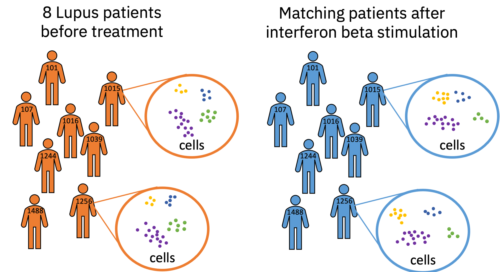

```{r, include = FALSE}
knitr::opts_chunk$set(
  collapse = TRUE,
  comment = "#>"
)
set.seed(2)
```


# Pseudobulk

A pseudobulk sample is formed by aggregating the expression values from a group of cells from the same individual. The cells are typically grouped by clustering or cell type assignment. Individual refers to the experimental unit of replication (e.g., the individual mice or patients).

Forming pseudobulk samples is important to perform accurate differential expression analysis. Cells from the same individual are more similar to each other than to cells from another individual. This means treating each cell as an independent sample leads to underestimation of the variance and misleadingly small p-values. Working on the level of pseudobulks ensures reliable statistical tests because the samples correspond to the units of replication.

We can use pseudobulks for example to find the expression changes between two conditions for one cell type.

# Example

```{r out.width = '70%', echo = FALSE}

```

I load a `SingleCellExperiment` object containing gene expression counts from eight Lupus patient before and after interferon beta stimulation. The creator of the dataset has already annotated the cell types and if cell is a singlet.

```{r}
library(SingleCellExperiment)
sce <- muscData::Kang18_8vs8() 
# Keep only genes with more than 5 counts
sce <- sce[rowSums(counts(sce)) > 5,]
colData(sce)
```

The `pseudobulk` functions emulates the `group_by` and `summarize` pattern popularized by the `tidyverse`.
You provide the columns from the `colData` that you want to use for grouping the data (akin to `group_by`) and named arguments specifiying how you summarize the remaining columns (akin to `summarize`). Using the `aggregation_functions` you can set how the `assay`'s and `reducedDim`'s are summarized with a named list.

Here, I create a pseudobulk sample for each patient, condition, and cell type. This means for example that the counts of the 119 B-cells from patient 101 in the control condition are summed to one column in the reduced dataset. 

The first argument is a `SingleCellExperiment` object. The `group_by` argument uses `vars()` to quote the grouping columns The `fraction_singlet` and `n_cells` arguments demonstrate how additional columns from the `colData` are summarized. For `fraction_singlet`, I use the fact that `mean` automatically coerces a boolean vector to zeros and ones and `n_cells` demonstrates the `n()` function that returns the number of cells that are aggregated for each group.
```{r}
library(glmGamPoi)
reduced_sce <- pseudobulk(sce, group_by = vars(ind, condition = stim, cell), 
                          fraction_singlet = mean(multiplets == "singlet"), n_cells = n())
colData(reduced_sce)
```
You can simulate the pseudobulk sample generation and check if you are using the correct arguments by calling `dplyr::group_by`. Note that the order of the output differs because `group_by` automatically sorts the keys.
```{r}
library(dplyr, warn.conflicts = FALSE)
colData(sce) %>%
  as_tibble() %>%
  group_by(ind, condition = stim, cell) %>%
  summarize(n_cells = n(), .groups = "drop") 
```


With the reduced data, we can conduct differential expression analysis the same way we would analyze bulk RNA-seq data (using tools like `DESeq2` and `edgeR`).
For example we can find the genes that change most upon treatment in the B-cells

```{r}
# Remove NA's
reduced_sce <- reduced_sce[,!is.na(reduced_sce$cell)]
# Use DESeq2's size factor calculation procedure
fit <- glm_gp(reduced_sce, design = ~ condition*cell + ind, size_factor = "ratio", verbose = TRUE)
res <- test_de(fit, contrast = cond(cell = "B cells", condition = "stim") - cond(cell = "B cells", condition = "ctrl"))
```

A volcano plot gives a quick impression of the overall distribution of the expression changes.
```{r}
library(ggplot2, warn.conflicts = FALSE)
ggplot(res, aes(x = lfc, y = - log10(pval))) +
  geom_point(aes(color = adj_pval < 0.01), size = 0.5)
```


# Legacy

Originally, `glmGamPoi`'s API encouraged forming pseudobulks after fitting the model (i.e., within `test_de()`). The advantage was that this reduced the number of functions. Yet, internally `glmGamPoi` basically threw away the original fit and re-ran it on the aggregated data. This meant that computation time was wasted. Thus the original approach forming the pseudobulk in `test_de` is now deprecated in favor of first calling `pseudobulk()` and then proceed by calling `glm_gp()` and `test_de()` on the aggregated data.


